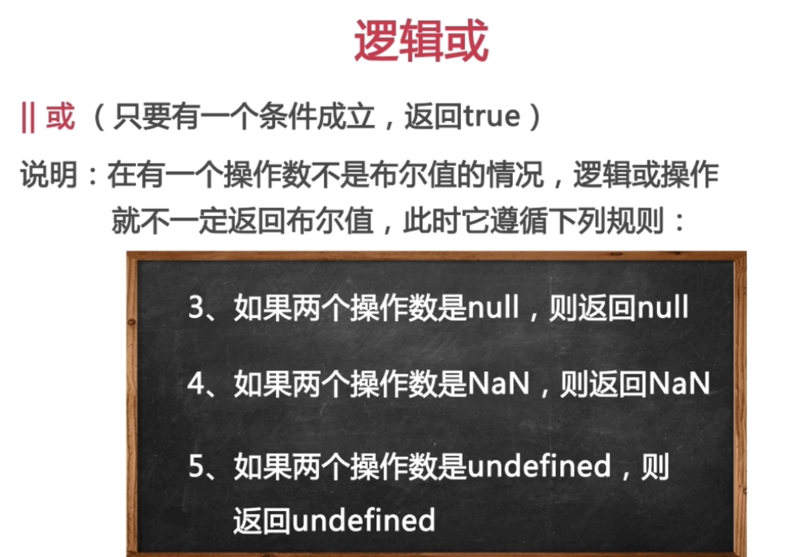
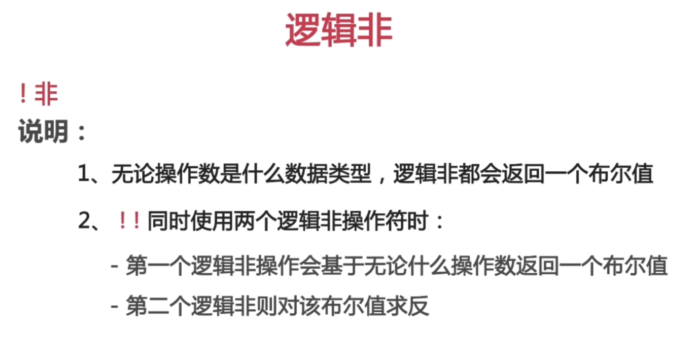

# 5.2 逻辑或逻辑非







```html
<script>
  console.log(!false);//true
  console.log(!88);//false
  console.log(!0);//true
  console.log(!"red");//false
  console.log(!NAN);//true
  console.log(!Null);//true
  
  
  console.log(!!"");//false
  console.log(!!"blue");//true
  </script>
```

