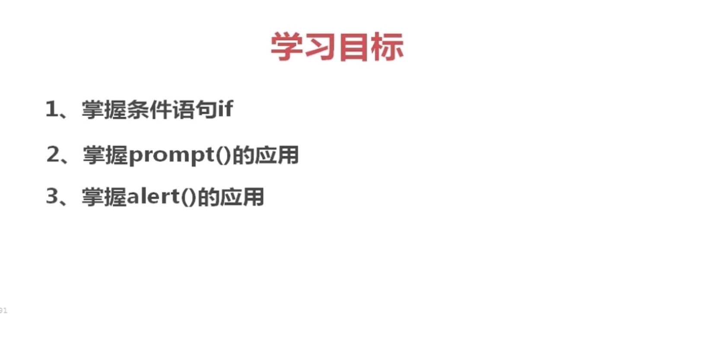
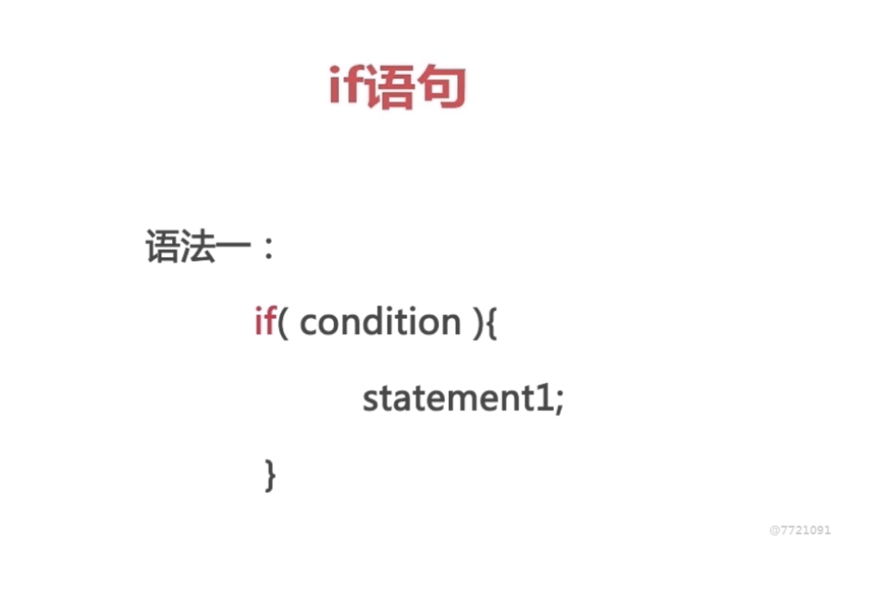
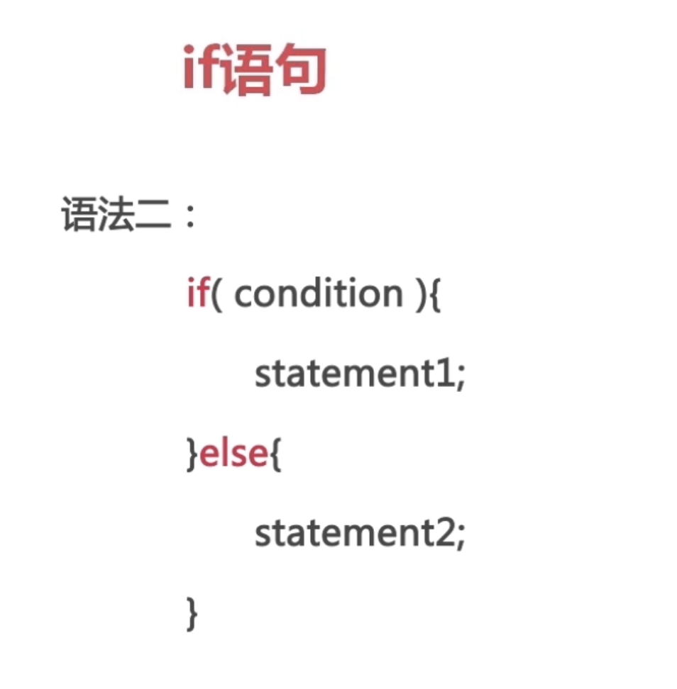
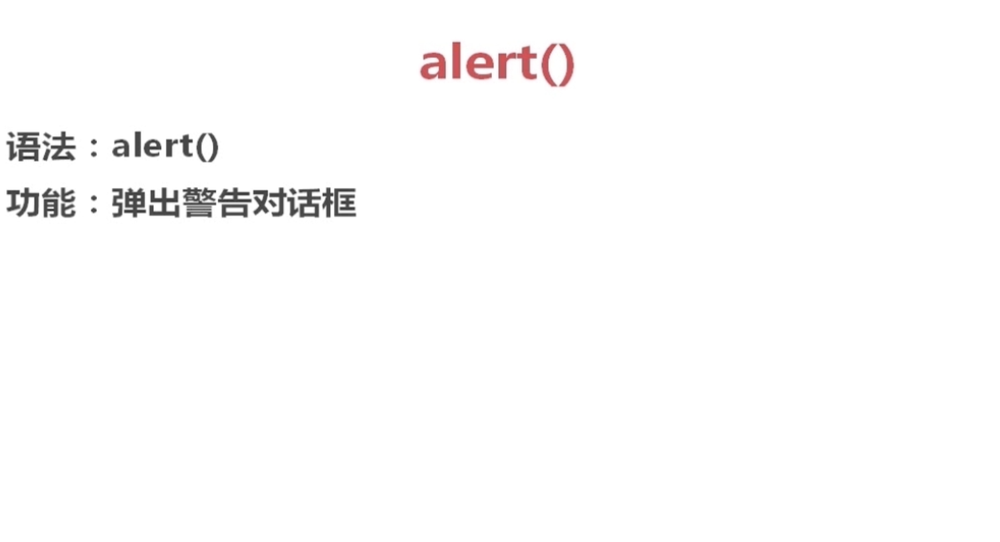
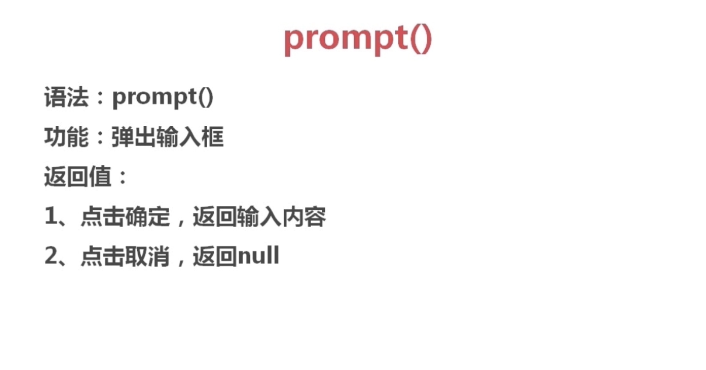

# 1.1 if语句


## 1.学习目标





## 2.if语句







## 3.alert()



```html
alert("您还有没有成年")
```


## 3.prompt()





## 4.Coding

```html
<script>

  var age = prompt("请输入您的年龄");
  if(age<18){
    alert("您还没有成年");
  }else if(age>=18 && age <=59){
    alert("您可以进入");
  }else{
    alert("超出年限");
  }

</script>
```


