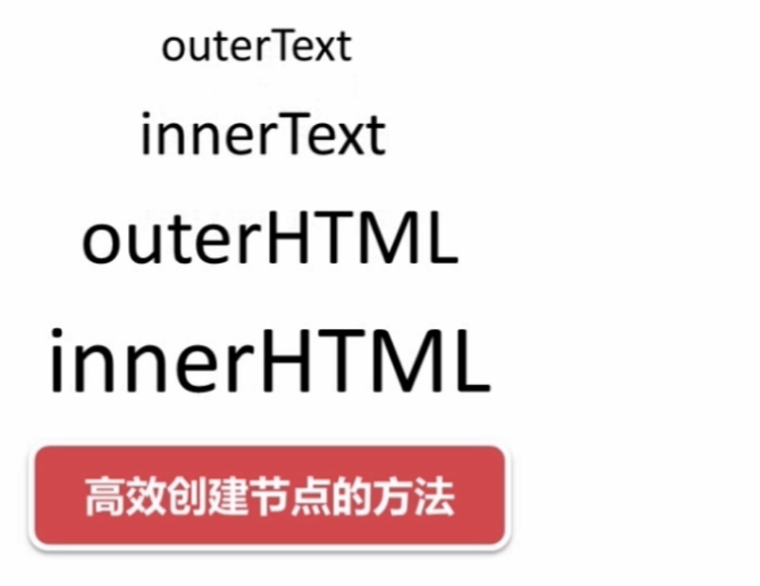
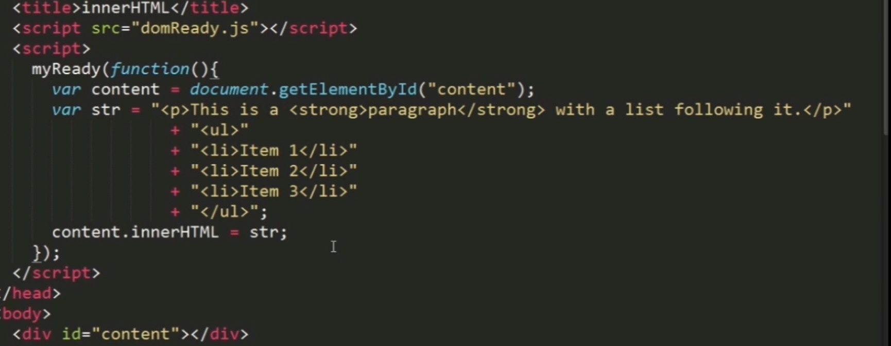
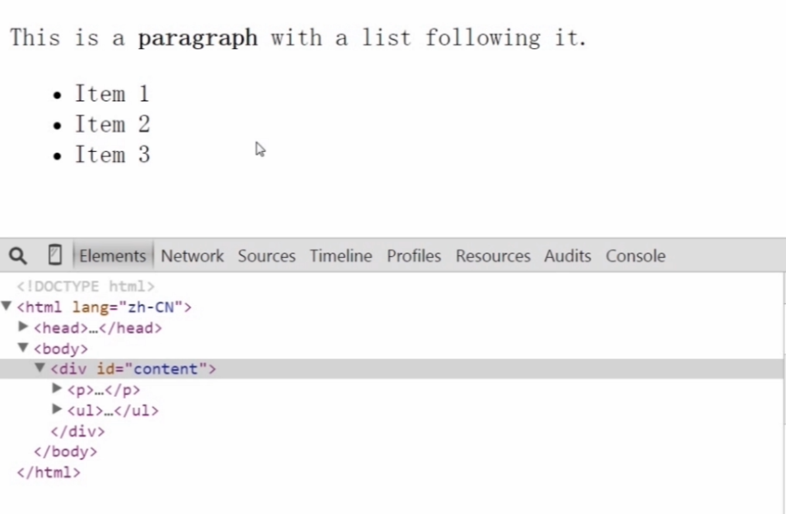
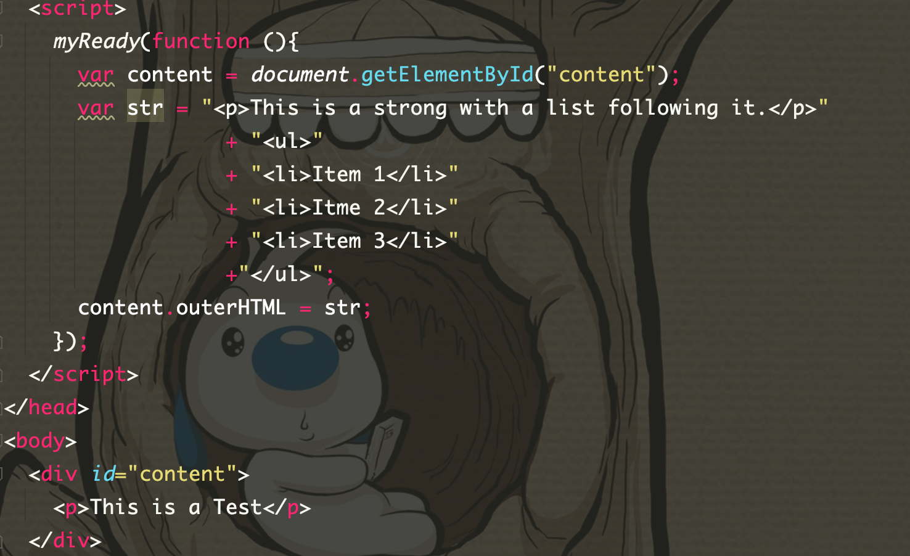
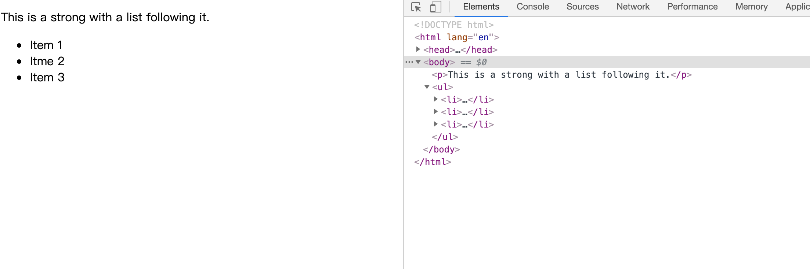

# 2-6 高效创建节点的方法(innerHTML-outerHTML)

> 使用innerHTML注意 写模式并不会替换content的div标签 它只会在div内新增

> 使用outterHTML 的写模式，会把外层的content的标签div给去掉，这就是和innerHTML的区别

> 当然读的模式也是类似的innderHTML 会带有div标签  而outterHTML不会带div标签
