# 3.7 querySelector()和querySelectorAll()方法

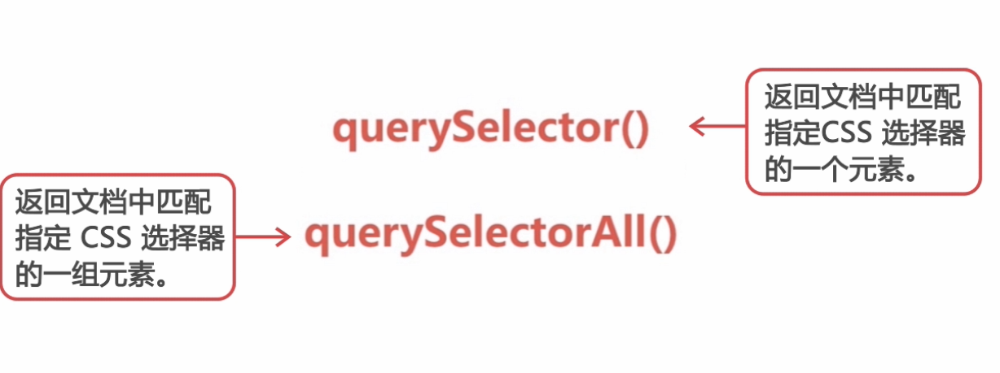

## querySelector

主流的浏览器基本都支持，传入#myUl 这是css的id

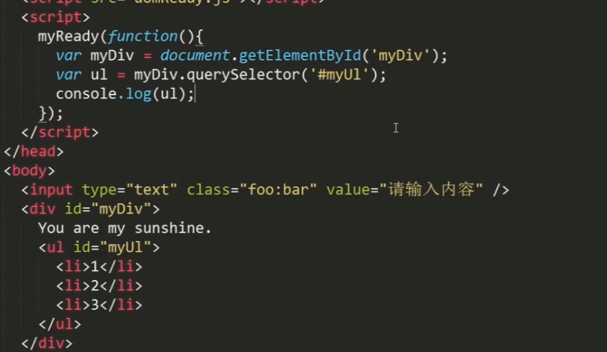

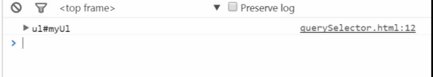

找最后一个li

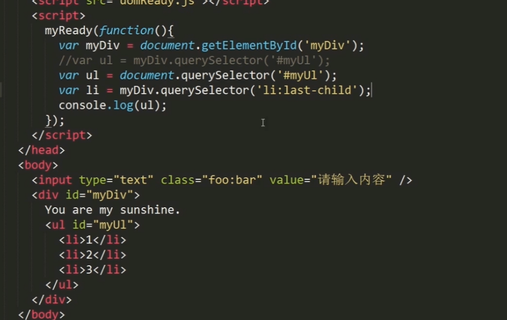

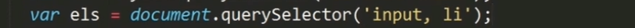

querySelector只能找到一个元素，所以它找到input元素就返回了

要想找到所有的元素，要使用querySelectorAll方法

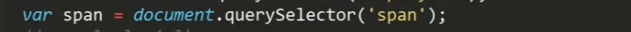

找不存在的元素

通过class的值来获取元素对象

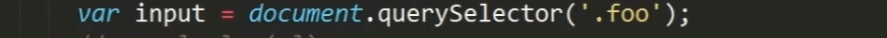

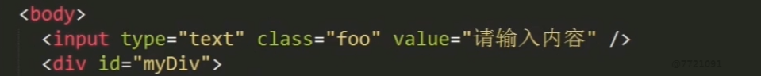

但是class中不能有违规字符，要不会报错，必须进行转义，：转义成\: 但是\也是违规的，所以再加\

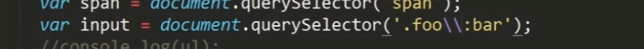

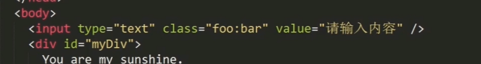

## querySelectorAll

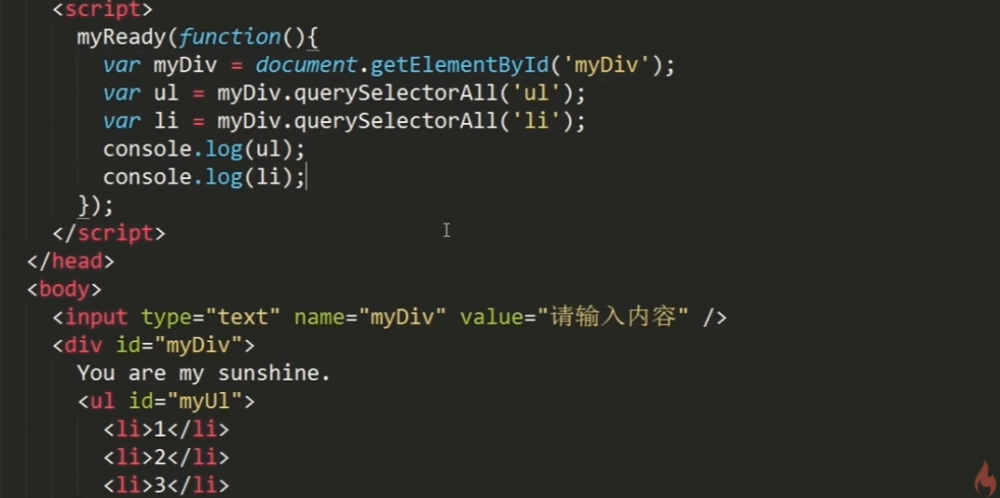

获取到的是NodeList

试图获取一个不存在的元素

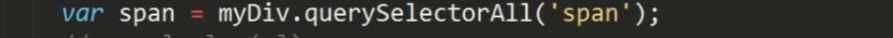

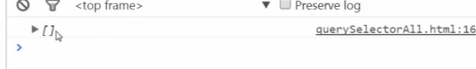

虽然获取的是NodeList 类数组对象，但是不是纯正的NodeList是静态的NodeList  之前有说到NodeList具有动态性，但是静态的NodeList不具有

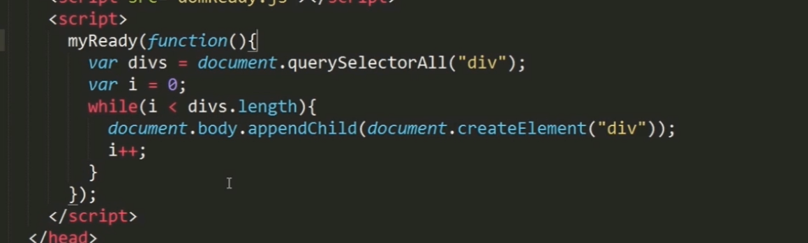

这段代码使用querySelectorAll来动态添加，是不会进入死循环的

