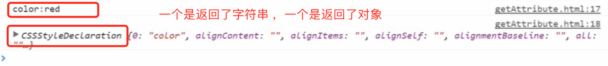

# 2.5 getAttribute

怎么操作固有属性

通过.

但是不能通过.来访问自定义属性

有没有通用的方法来访问自定义属性和固有属性呢

getAttribute

> 注意：1.属性名不区分大小写，无论是声明自定义属性还是在调用 getAttribute时传入大小写，最后都 会被 转为小写，所以不影响获取属性的名称
>
> 2.style
>
> 3.onclick
>
> 这两个属性通过. 和getAttribute拿到的是不一样的

