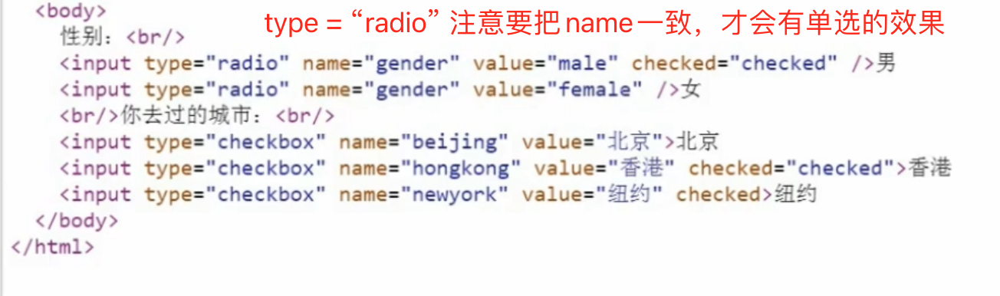
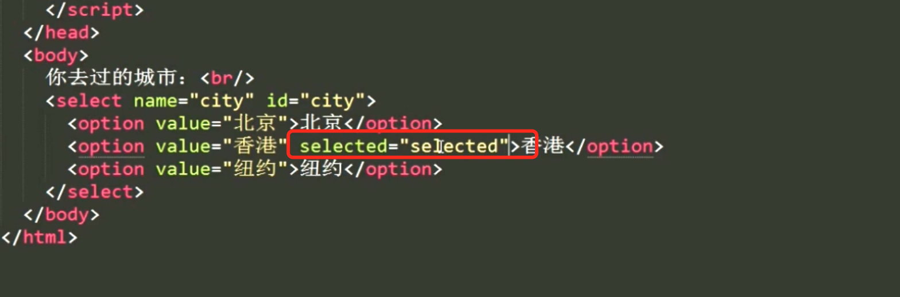
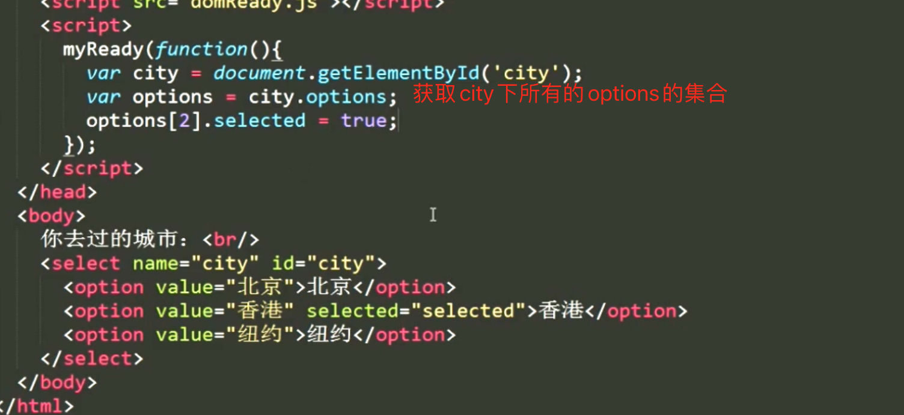
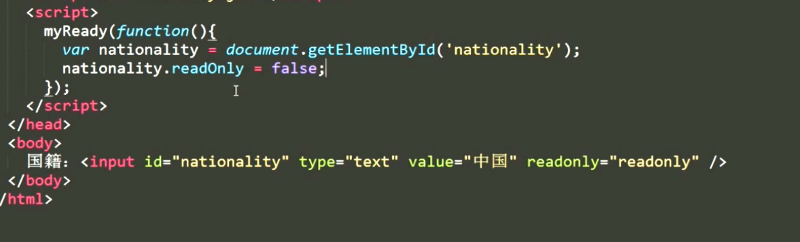
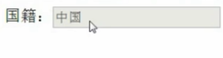
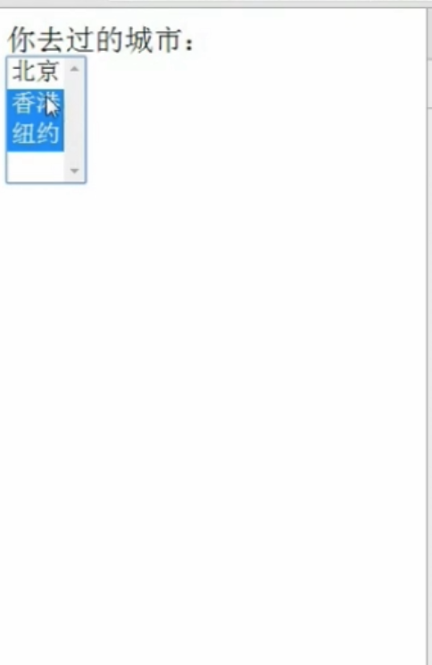

# 3.2 布尔属性详解

第二个布尔属性  selected

香港就被选中了

readOnly

input 设置了readOnly只能读不能编写

disabled 效果

和readOnly有什么区别呢？

> 使用disabled 即使表单提交了，后端也不会收到表单的值 这个很重要

multiple 多选 

让select变成多选

hidden

页面内容消失  且不占用空间

