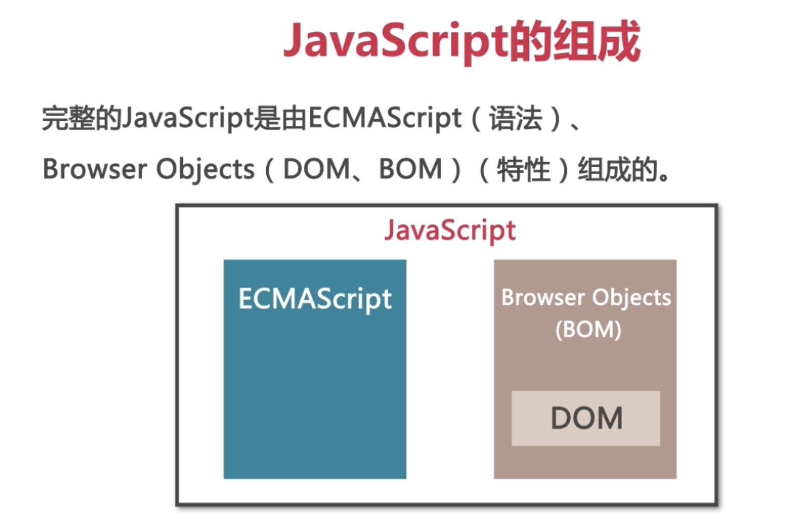
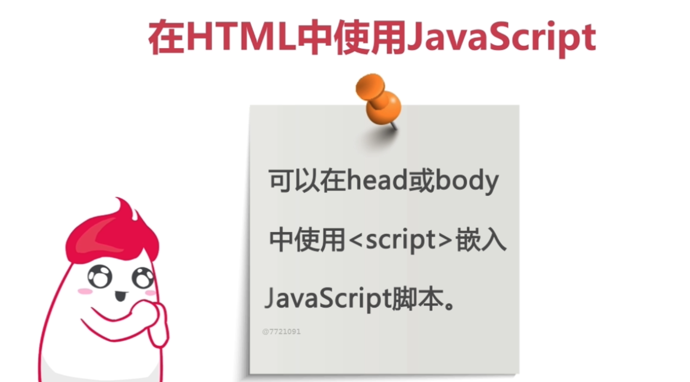

# Javascript

### JavaScript 的组成

&emsp; &emsp; 那么接下来呢我们说一下javascript的组成。那么完整的Javascript呢是由ECMScript、DOM和BOM这三部分组成的。

&emsp; &emsp; 那么ECMScript呢它主要提供的就是核心语言的功能，就是相当于它的语法。那么DOM呢它是提供访问和操作网页内容的方法和接口。大家知道啊，我们Javascript是专们与网页交互设计开发的这么一种脚本语言，所以说它肯定需要提供我们和网页内容之间的一个接口，那这个接口呢就是由DOM来完成的。

&emsp; &emsp; 那么BOM呢它是提供了引流浏览器交互的方法和接口，比如说我们打开一个浏览器窗口，或者是我们对我们的浏览器窗口进行的缩放呀或者是移动等等操作，那么使用BOM。

### 在HTML中使用JavaScript

